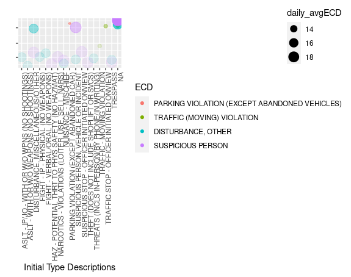
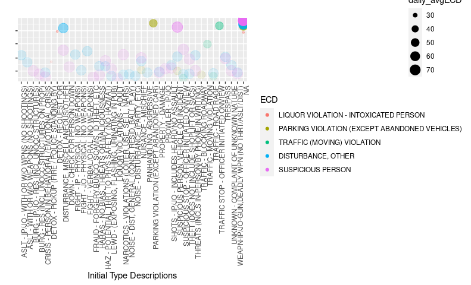

```{r setup, include=FALSE}
knitr::opts_chunk$set(echo = TRUE)
library(tidyverse)
```

```{r dataprep-file-source, include=FALSE}
source("Seattle911PDProject_Script.R", local = knitr::knit_global())
```

\newpage

# Introduction

This is the `r rmarkdown::metadata$title` for `r rmarkdown::metadata$info_course` from `r rmarkdown::metadata$info_program` offered by `r rmarkdown::metadata$info_institution` prepared by `r rmarkdown::metadata$author`.

Final Report includes methodology and results of the analysis. Also, this report includes project environment description used for building and running the code.

## Project Goal

This is a Machine Learning project. Main goal of the project consists in training an algorithm that predicts Event Clearance Code of **Seattle Police Department 911 Incident Response** data set.

Sub goal of the project consists in:

* Analyzing **Seattle Police Department 911 Incident Response** data to obtain the best features from the data set and improve interpretability
+ Analyzing variable importance
+ Obtaining best tune to achieve highest accuracy, specificity, sensitivity values in the confusion matrix

## Project Data and preprocessing for download

Project data is based on **Seattle Police Department 911 Incident Response** cleaned data set from [*Kaggle*](https://www.kaggle.com/sohier/seattle-police-department-911-incident-response). The original data file was downloaded and processed using [*Seattle911DataPrepScript.sh*](https://github.com/khaliunb/Seattle911PDProject/blob/fe35003ed71cdae22966a168b7728724403d3a7c/Seattle911DataPrepScript.sh) bash script to pre-process the data to obtain intended amount of lines of data and also replace the header. Resulting data file was then uploaded to [*Github Repository*](https://github.com/khaliunb/Seattle911PDProject/tree/main/data) and is available for download.

## Project Files

Project data and script files and folders are uploaded [*Seattle911PDProject Github Repository*](https://github.com/khaliunb/Seattle911PDProject.git)).  Uploaded Files Include:
 
* Data File - "data/SeattlePD911IR_80_MB.zip" available for download and used for the project script
* RMarkdown Report File - "Seattle911PDProject_FinalReport.Rmd" which is the current report file
* R Script File - "Seattle911PDProject_Script.R" that includes codes and comments for model fitting and training
* PDF Report - "Seattle911PDProject_FinalReport.pdf"

Github repository also holds additional files and folders used for the project and knitting the report.

## Project Environment

Codes for the project were built and tested using:

* R version 3.6 and
+ RStudio Version 1.3.1073
+ Linux Ubuntu 20.04

\newpage

# Method

## Pre-processing the data

Code downloads and populates the data file into **S911IR** data set.

Additional features related to timing had been mutated into the data set we are using. Here is the list descriptions of data headers.

```{r (S911IR_Head), echo=FALSE}
S911IR_Head%>%knitr::kable()
```

Basic overview of data, revealed that we probably have incomplete records before June of 2010. Therefore we are trimming the original data to records between 1st of July, 2010 and 31st December, 2017.

Overview of data revealed data record number drop between 2013 and 2014 year. The data is probably missing. Therefore, We are removing this part of data from the data set.

Also, for large amount of data for Initial Type description/subgroup/group and At Scene time records are missing. 

We have chosen the features for our prediction. NAs are not permitted in random forest predictors. But the ITDesc, ITSG and ITG field NAs are valuable. We have to replace NAs within those columns by further processing the *S911IR* data set. Therefore, we are correcting the data by changing ITDesc, ITSG, ITG NAs to "UNKNOWN" character values.

Here is how ITDesc and other initial type features' NAs looked like:

```{r itdesc-na-before-replacement,eval=FALSE}
S911IR%>%filter(is.na(ITDesc)|is.na(ITSG)|is.na(ITG))%>%
  group_by(ITDesc,ITSG,ITG)%>%
  summarise(n=n())%>%
  select(ITDesc,ITSG,ITG,n)%>%
  knitr::kable()
```

|ITDesc |ITSG |ITG |      n|
|:------|:----|:---|------:|
|NA     |NA   |NA  | 144483|

And here is how ITDesc and other initial type features' NAs looked like after NA Replacement with "UNKNOWN" character string:

```{r itdesc-na-after-replacement,eval=FALSE}
#We are using this code to replace the fields
S911IR<-S911IR%>%replace_na(list(ITDesc="UNKNOWN",ITSG="UNKNOWN",ITG="UNKNOWN"))

S911IR%>%filter(is.na(ITDesc)|is.na(ITSG)|is.na(ITG))%>%
  group_by(ITDesc,ITSG,ITG)%>%
  summarise(n=n())%>%
  select(ITDesc,ITSG,ITG,n)%>%
  knitr::kable()
```

|ITDesc  |ITSG    |ITG     |      n|
|:-------|:-------|:-------|------:|
|UNKNOWN |UNKNOWN |UNKNOWN | 144483|

Then, we trim the data columns by selecting all the features used for predictions and remove all NAs from the resulting data set by using this code:

```{r s911ir-na-drop,eval=FALSE}
S911IR<-S911IR%>%drop_na()
```

## Data Set for training

We will take a glimpse at **S911IR** data set:

```{r (S911IR), echo=FALSE}
S911IR%>%glimpse()
```
Resulting data set has *`r nrow(S911IR)` rows* and *`r ncol(S911IR)` columns*. 

For training purposes, data is divided into **train_set** and **test_set**:

* **train_set** - 80% of the complete **Seattle Police Department 911 Incident Response** data set
 + **test_set** - 20% of the complete **Seattle Police Department 911 Incident Response** data set

Furthermore, **train_set** data set had been matched with **test_set** data set and all recurring data had been removed from **test_set** data set.

Summary of **train_set** data set:

```{r (train_set), echo=FALSE}
summary(train_set)
```

Summary of **test_set** data set:

```{r (test_set), echo=FALSE}
summary(test_set)
```

\newpage

## Questions Posed

Before we handle any of the data? We have three questions to answer:

* What Are We Predicting?
* What Features Will We Use for Predictions?
* How Are We Gonna Predict?

From my perspective, the linear model is not applicable here. The best way to approach this problem is to train the data with random forest algorithm and see what happens. However, we need to develop a way to make it more interpretable. And also we have to consider the amount of resources and time random forest algorithm consumes.

By this point, we are looking at more definite description of our project's problem. We need to experiment with data, to test out different assumptions. General questions we needed to answer:

1. What if we only group the full data features into subsets of groups?
2. How many groups the data should the features be divided into?
3. Should we consider regularization?
4. What happens if we feed the train the clustered group features random forest algorithm, and what is the best tune?
5. How much accuracy can we get with predicting the event clearance?

From the data set, we assume that the features can be divided into location, timing, and situation groups. From here, we answer to more detailed questions:

- Which are the event clearance groups/subgroup/description that occur the most?
- Which are the most frequently occurring event clearance group and incident type group pair?/Is there relation between incident type group/subgroup/description and event clearance group/subgroup/description?
- Is there relation between location and event clearance description/subgroup/description?
    - Is there certain prevalence in overall number of event clearance description/subgroup/description in certain location?
- Is there relation between timing and event clearance description/subgroup/description?
    - Was there increase/decrease in event clearance description/subgroup/description overall occurrence over time?
    - During which season event clearance description/subgroup/description overall occurrence increases/decreases?
    - On which day of the week event clearance description/subgroup/description overall occurrence increases/decreases?
    - During which hour of the day event clearance description/subgroup/description overall occurrence increases/decreases?
    
These questions clarify the answer which of the event clearance group subgroup/description features we are predicting.

Also we are considering recurrence of certain groups of events clearance and incident types:

- Is there relation between number of recurrence of certain incident type group/subgroup/description in data and event clearance group/subgroup/description?
- Is there relation between number of recurrence of certain event clearance group/subgroup/description in data and timing of the incident type group/subgroup/description?
- Is there relation between number of recurrence of certain event clearance group/subgroup/description in data and location of the incident type group/subgroup/description?
- Is there certain pattern of increase/decrease recurrence of certain event clearance group/subgroup/description in data in relation to location?
    - Is there certain prevalence in number of certain event clearance description/subgroup/description in certain location?
- Is there certain pattern of increase/decrease recurrence of certain event clearance group/subgroup/description in data in relation to timing?
    - Was there increase/decrease in certain event clearance description/subgroup/description occurrence over time?
    - During which season certain event clearance description/subgroup/description occurrence increases/decreases?
    - On which day of the week certain event clearance description/subgroup/description occurrence increases/decreases?
    - During which hour of the day certain event clearance description/subgroup/description occurrence increases/decreases?

\newpage

# Analysis and Results

We will view overall occurence plots side by side to get a clear idea.

Note: Results section contains plots and summary results of the analysis process. Plots had been saved and are stored in *images* folder.

This section demonstrates the results for *S911IR* Project data before we pre-processed (removed any of data or cleaned from NAs).

Due to the fact data was likely missing, it is probably best to compare the analysis results for both sampled data we are using and the complete 380MB data downloaded from Kaggle. This will help is see if the data was properly sampled, and also answer the question "What happens if we use the incomplete data set?". Plots have been aligned side by side for better comparison.

Lists we represent here in the analysis results have been prepared using the sampled Project data we are using.

## Questions answered

### Basic Question: What are we predicting?

We are predicting *ECD* value. From data, we see the incident description and the event clearance descriptions rarely match for events viewed as "criminal" and "suspicious". We also see that traffic incidents have clearer descriptions. This may relate to the fact that people's eyes recognize "suspicious" may be viewed differently depending on circumstances. We may view it as additional motivation for predicting the event clearance prior to dispatching police department.

### Question: What is the overall picture of overall occurence of event clearance description? Also, do some ECDs prevail over others on daily basis?

We will view overall occurence plots side by side to get a clear idea.

```{r,plot-ecd-overall-occur,fig.cap='Seattle 911 Incident Response: Event Clearance Description Overall Occurence', fig.subcap=c('Full Kaggle Data','Project Data'), fig.show="hold", out.width="50%", echo=FALSE}
knitr::include_graphics(c("images/Rplot1_ECDOverallOccurence_FullData.png","images/Rplot1_ECDOverallOccurence_80MBData.png"))
```

We can also see that the picture changes when we consider daily averages.

```{r,plot-ecd-daily-avg-occur,fig.cap='Seattle 911 Incident Response: Event Clearance Description Daily Average Occurence', fig.subcap=c('Full Kaggle Data','Project Data'), fig.show="hold", out.width="50%", echo=FALSE}
knitr::include_graphics(c("images/Rplot2_ECDDailyAvgOccurence_FullData.png","images/Rplot2_ECDDailyAvgOccurence_80MBData.png"))
```

From the plot we see some bars that significantly prevail over others. So, which are the event clearance description that occur the most? And do they also prevail on daily basis? We are considering the project data in detail.

Project data for Large Occurence ECDs

```{r eval=FALSE}
S911IR%>%group_by(date(EC_DateTime),ECD)%>%summarise(daily = n())%>%
    ungroup()%>%group_by(ECD)%>%
    summarise(overall=sum(daily),daily_avg=mean(daily),daily_median=median(daily))%>%
    filter(overall>20000)%>%arrange(desc(overall))%>%
    select(ECD,overall,daily_avg,daily_median)%>%
  knitr::kable()
```

|ECD                                           | overall| daily_avg| daily_median|
|:---------------------------------------------|-------:|---------:|------------:|
|SUSPICIOUS PERSON                             |   40587|  19.08181|           19|
|DISTURBANCE, OTHER                            |   35039|  16.53563|           16|
|TRAFFIC (MOVING) VIOLATION                    |   26387|  12.46434|           12|
|PARKING VIOLATION (EXCEPT ABANDONED VEHICLES) |   25803|  12.24051|           12|

We can also see group of bars in project data plot that have occurences between 8'000 and 20'000 (in full data version, these numbers are between 20'000 and 50'0000). And do they what is their average occurence on daily basis? Which are the event clearance description that form the group? We are considering the project data in detail.

Project data for Middle Occurence ECDs

```{r eval=FALSE}
S911IR%>%group_by(date(EC_DateTime),ECD)%>%summarise(daily = n())%>%
    ungroup()%>%group_by(ECD)%>%
    summarise(overall=sum(daily),daily_avg=mean(daily),daily_median=median(daily))%>%
    filter(overall>=8000 & overall<=20000)%>%
    arrange(desc(overall))%>%
    select(ECD,overall,daily_avg,daily_median)%>%
  knitr::kable()
```

|ECD                                   | overall| daily_avg| daily_median|
|:-------------------------------------|-------:|---------:|------------:|
|LIQUOR VIOLATION - INTOXICATED PERSON |   14792|  7.030418|            7|
|SUSPICIOUS VEHICLE                    |   12031|  5.770264|            5|
|THEFT - CAR PROWL                     |   11029|  5.320309|            5|
|TRESPASS                              |   10681|  5.238352|            5|
|THEFT - MISCELLANEOUS                 |   10226|  4.956859|            5|
|MISCHIEF, NUISANCE COMPLAINTS         |   10149|  4.960411|            4|
|ACCIDENT INVESTIGATION                |    9848|  9.917422|           10|
|MOTOR VEHICLE COLLISION               |    9629| 12.297573|           12|
|SHOPLIFT                              |    9612|  4.732644|            5|
|NOISE DISTURBANCE                     |    9223|  4.634673|            4|

Those ECDs that are present, but can be viewed as separate occurences should also be noted.
So, what are the ECDs that have barely existent occurences? We are considering the project data in detail and picking out that have least number of occurences. But we are considering the fact that data is probably missing between 2013 and 2014. Therefore we are considering years between July, 2010- February 2013 and July, 2014 - December 2017.

```{r eval=FALSE}
S911IR%>%filter(!((EC_DateTime>make_date(year=2014,month=2,day=1))
                  &(EC_DateTime<make_date(year=2014,month=7,day=1))))%>%
  group_by(date(EC_DateTime),ECD)%>%summarise(daily = n()) %>%
  ungroup()%>%group_by(ECD)%>%
  summarise(overall=sum(daily),daily_avg=mean(daily),daily_median=median(daily))%>%
  filter(overall<50)%>%arrange(overall)%>%select(ECD,overall,daily_avg,daily_median)%>%
  knitr::kable()
```

|ECD                                                     | overall| daily_avg| daily_median|
|:-------------------------------------------------------|-------:|---------:|------------:|
|HARBOR - BOATING UNDER THE INFLUENCE                    |       1|  1.000000|            1|
|HARBOR - MARINE FIRE                                    |       1|  1.000000|            1|
|HARBOR - VESSEL RECOVERY                                |       2|  1.000000|            1|
|SOAP (STAY OUT OF AREA OF PROSTITUTION) ORDER VIOLATION |       4|  1.000000|            1|
|TRAFFIC - SCHOOL ZONE ENFORCEMENT                       |       6|  1.000000|            1|
|LIQUOR VIOLATIONS (BUSINESS)                            |       7|  1.166667|            1|
|TRAFFIC - BICYCLE VIOLATION                             |       8|  1.000000|            1|
|HARBOR - VESSEL ABANDONED                               |      10|  1.000000|            1|
|HARBOR - VESSEL THEFT                                   |      11|  1.000000|            1|
|PORNOGRAPHY                                             |      14|  1.000000|            1|
|AWOL                                                    |      15|  1.000000|            1|
|GAMBLING                                                |      15|  1.000000|            1|
|TRAFFIC - COMMUNITY TRAFFIC COMPLAINT (CTC)             |      15|  1.071429|            1|
|LOST PERSON                                             |      18|  1.000000|            1|
|ASSAULTS, GANG RELATED                                  |      20|  1.000000|            1|
|HARBOR - BOAT ACCIDENT                                  |      20|  1.000000|            1|
|CRISIS COMPLAINT - PICK-UP OR TRANSPORT                 |      23|  1.000000|            1|
|HARBOR - ASSIST BOATER (NON EMERGENCY)                  |      25|  1.000000|            1|
|DEMONSTRATION MANAGEMENT (Control tactics used)         |      26|  1.083333|            1|
|HARBOR - CODE VIOLATION                                 |      31|  1.033333|            1|
|NARCOTICS WARRANT SERVICE                               |      33|  1.031250|            1|
|PURSUIT                                                 |      34|  1.000000|            1|
|MENTAL PERSON PICK-UP OR TRANSPORT                      |      36|  1.058823|            1|
|TRAFFIC CONTROL (SPECIAL EVENTS)                        |      46|  1.069767|            1|
|HARBOR - DEBRIS, NAVIGATIONAL HAZARDS                   |      47|  1.021739|            1|

We are using boxplot to see more clear picture. And here we are considering group of ECDs that have overall occurence of more than 8'000. For full data, the trimming point for "Large overall" occurences had been above 20'000. But for Project data it had been 8'000 for this plot. We are comparing the Project data and Full Kaggle data results side by side. But the overall picture is the same.

```{r,plot-ecd-daily-avg-quantile,fig.cap='Seattle 911 Incident Response: ECD Quantile Daily Average Occurence', fig.subcap=c('Full Kaggle Data','Project Data'), fig.show="hold", out.width="50%", echo=FALSE}
knitr::include_graphics(c("images/Rplot3_LargeECDDailyOccurBoxplot_FullData.png","images/Rplot3_LargeECDDailyOccurBoxplot_80MBData.png"))
```

### Question: Do Initial Type Descriptions match Event Clearance Description, or do people commonly mistake the symptoms of the situation very often?

Here, we are bringing in the Initial Type Description to see whether they match the resulting Event Clearance Description. We are comparing the Project data and Full Kaggle data results side by side.

```{r,dotplot-ecd-itdesc-kaggle,fig.cap='Seattle 911 Incident Response: Event Clearance Description vs Initial Type Description - Project Data', out.width="100%", echo=FALSE}

```

For this Dot plot, alpha opaqueness represents high daily average Initial Type Description. 

From the Project data plot we see clearly that:
* "NA"s in ITDesc occur most frequently. But it is not a missing data. It is due to failure of callers to describe the incident. Operators at 911 do not initially know what happened.
* ECD "Suspicious person","Disturbance, Other" is most prevalent for most reasons. Which we can attribute to the fact that this type of description is applicable to most circumstances.
* ECD "PARKING VIOLATIONS (EXCEPT ABANDONED VEHICLES)" have the least daily average for ECD, but the most daily average for ITDesc. Which means while this type of ECD happens less, people identify the reason for this ECD most clearly.

```{r,dotplot-ecd-itdesc-project,fig.cap='Seattle 911 Incident Response: Event Clearance Description vs Initial Type Description - Full Kaggle Data', out.width="100%", echo=FALSE}

```
From full data, we see that:
* DETOX - REQUEST FOR result in DISTURBANCE, OTHER
* PARKING VIOLATIONS (EXCEPT ABANDONED VEHICLES), TRAFFIC - MOVING VIOLATION in ITDesc match the ECD directly

And here we see another more insightful aspect:

* SHOTS - IP/JO - INCLUDES HEARD/NO ASSAULT results in Event Clearance Description of SUSPICIOUS PERSON
This may describe the degree of fear of guns and shots in Seattle citizens, and the fact that these rarely are founded assumptions.

Here is another version of the plot to see whether there are relationship between the ECD and ITDesc. Again, we are comparing the Project data and Full Kaggle data results side by side.

```{r,dotplot2-ecd-itdesc,fig.cap='Seattle 911 Incident Response: Event Clearance Description vs Initial Type Description', fig.subcap=c('Full Kaggle Data','Project Data'), fig.show="hold", out.width="50%", echo=FALSE}
knitr::include_graphics(c("images/Rplot5_ECDvsITDescDotplot2_FullData.png","images/Rplot5_ECDvsITDescDotplot2_80MBData.png"))
```

For this version of the plot, color represents ITDesc groups, while ECDs are represented by shape.
For full data, the trimming point for "Large ECD" occurences had been above 50'000. But for Sample data it had been 20'000 for this plot. We are comparing the results side by side. But the overall picture is the same.

### Question: Is there relation between timing and event clearance description?

#### Was there increase/decrease in event clearance description overall occurrence over time? We are building Timeline plot to see this.

```{r,plot-ecd-timeline,fig.cap='Seattle 911 Incident Response: ECD Timeline', fig.subcap=c('Full Kaggle Data','Project Data'), fig.show="hold", out.width="50%", echo=FALSE}
knitr::include_graphics(c("images/Rplot6_TimelineECD_FullData.png","images/Rplot6_TimelineECD_80MBData.png"))
```

From the plot, we see sharp drop in daily total number around 2014. So what happened here? We investigate by detailing the plot by ECD and faceting daily averages by year versus month.

```{r,plot-ecd-faceted-timeline, fig.cap='Seattle 911 Incident Response: ECD Timeline Faceted by Year and Month', fig.subcap=c('Full Kaggle Data','Project Data'), fig.show="hold", out.width="50%", echo=FALSE}
knitr::include_graphics(c("images/Rplot7_FacetedTimelineByYearMonth_FullData.png","images/Rplot7_FacetedTimelineByYearMonth_80MBData.png"))
```

And here we see data largely missing between March of 2013 to June of 2014. And we also see that data after 1st of September, 2017 is missing. Therefore we have trimmed the Project data after that point.

#### During which month event clearance description overall occurrence increases/decreases?

```{r,plot-ecd-monthly-avg,fig.cap='Seattle 911 Incident Response: ECD Monthly Average', fig.subcap=c('Full Kaggle Data','Project Data'), fig.show="hold", out.width="50%", echo=FALSE}
knitr::include_graphics(c("images/Rplot8_ECDMonthlyAverage_FullData.png","images/Rplot8_ECDMonthlyAverage_80MBData.png"))
```

We also want to see what happens on a daily basis.

```{r,plot-ecd-daily-avg-by-month,fig.cap='Seattle 911 Incident Response: ECD Daily average by Month', fig.subcap=c('Full Kaggle Data','Project Data'), fig.show="hold", out.width="50%", echo=FALSE}
knitr::include_graphics(c("images/Rplot9_ECDDailyAverageByMonth_FullData.png","images/Rplot9_ECDDailyAverageByMonth_80MBData.png"))
```

From the histogram, we see surge of daily averages in July and August.

#### During which quarter event clearance description overall occurrence increases/decreases?

```{r,plot-quarterly-avg,fig.cap='Seattle 911 Incident Response: ECD Quarterly Average', fig.subcap=c('Full Kaggle Data','Project Data'), fig.show="hold", out.width="50%", echo=FALSE}
knitr::include_graphics(c("images/Rplot10_ECDQuarterlyAverage_FullData.png","images/Rplot10_ECDQuarterlyAverage_80MBData.png"))
```

We also want to see what happens on a daily basis.

```{r,plot-ecd-daily-avg-by-quarter,fig.cap='Seattle 911 Incident Response: ECD Daily average by Quarter', fig.subcap=c('Full Kaggle Data','Project Data'), fig.show="hold", out.width="50%", echo=FALSE}
knitr::include_graphics(c("images/Rplot11_ECDDailyAverageByQuarter_FullData.png","images/Rplot11_ECDDailyAverageByQuarter_80MBData.png"))
```

We can see definite surge of daily average number of incidents in 3rd quarter.

#### On which day of the week event clearance description overall occurrence increases/decreases?

```{r,plot-ecd-daily-avg-by-weekday,fig.cap='Seattle 911 Incident Response: ECD Daily average by Weekday', fig.subcap=c('Full Kaggle Data','Project Data'), fig.show="hold", out.width="50%", echo=FALSE}
knitr::include_graphics(c("images/Rplot12_ECDDailyAveragesByWeekday_FullData.png","images/Rplot12_ECDDailyAveragesByWeekday_80MBData.png"))
```

According to the plot, none of the weekdays can be viewed as special.

#### During which hour of the day event clearance description overall occurrence increases/decreases?

```{r,plot-ecd-daily-avg-by-hour,fig.cap='Seattle 911 Incident Response: ECD Daily average by Hour', fig.subcap=c('Full Kaggle Data','Project Data'), fig.show="hold", out.width="50%", echo=FALSE}
knitr::include_graphics(c("images/Rplot13_ECDHourlyAverages_FullData.png","images/Rplot13_ECDHourlyAverages_80MBData.png"))
```

Hourly averages are practically the same. But in the sampled data, there is slight drop between 7AM and 8AM in daily average occurence. It can be due to sampling process of Project data.

\newpage

## Final model performance


\newpage

# Conclusion


\newpage

# Contact Information {-}

If you have any questions regarding the project, please feel free to contact me at any of my emails: *`r rmarkdown::metadata$emails`*; or feel free to visit my [*Linkedin Profile*](`r rmarkdown::metadata$linkedin`)

# References {-}

## Books {-}

* @HarvardXDataScienceProgramTextbook
* @RMarkdownCookbook

## Articles {-}

* @kmeansclustering

## Manuals {-}

* @R-base
* @R-dplyr
* @R-ggplot2
* @R-tidyverse
* @lm